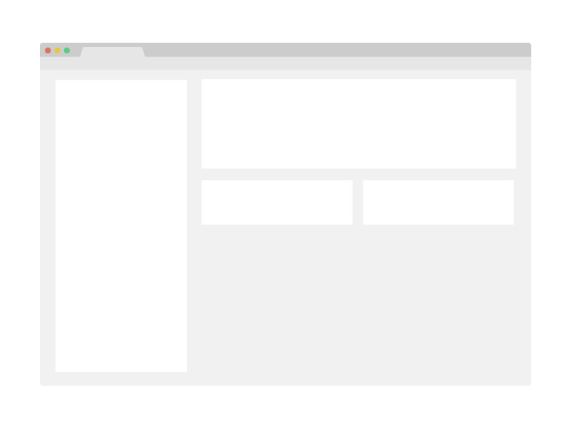

# C# Projects

> String Manipulation in C#: Develop a WordWand App
> Game Bots in C#: Develop a Tic-Tac-Toe Agent
> APIs in C#: Create a Student Management API

Additional description about the project and its features.

## Built With

- Major languages: C#
- Frameworks
- Technologies used

## Live Demo

[Live Demo Link](https://livedemo.com)

## Getting Started

**This is an example of how you may give instructions on setting up your project locally.**
**Modify this file to match your project, remove sections that don't apply. For example: delete the testing section if the currect project doesn't require testing.**

To get a local copy up and running follow these simple example steps.

### Prerequisites

### Setup

### Install

### Usage

### Run tests

### Deployment

## Authors

👤 **Syeda Juveria Afreen (SJA)**

- GitHub: [@githubhandle](https://github.com/sja-thedude)
- Twitter: [@twitterhandle](https://twitter.com/sja_thedude)
- LinkedIn: [LinkedIn](https://www.linkedin.com/in/sja-thedude/)

## 🤝 Contributing

Contributions, issues, and feature requests are welcome!

Feel free to check the [issues page](../../issues/).

## Show your support

Give a ⭐️ if you like this project!

## Acknowledgments

- Hat tip to anyone whose code was used
- Inspiration
- etc

## 📝 License

This project is [MIT](./MIT.md) licensed.
